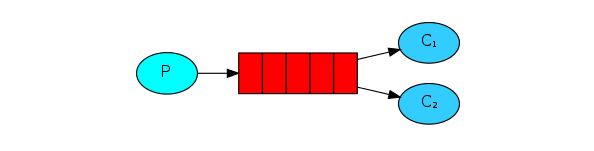
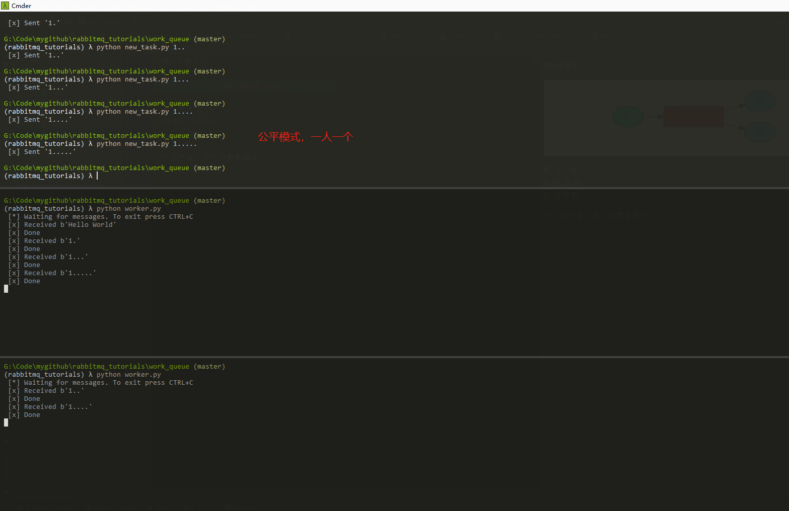

**Work模式**  

  

**P: 生产者**  
**红色: 队列**  
**C: 消费者**  

一个生产者，多个消费者模式  
  

> 有关消息持久性的说明  
> 将消息标记为持久性并不能完全保证不会丢失消息。尽管它告诉RabbitMQ将消息保存到磁盘，但是RabbitMQ接受消息并且尚未保存消息时，还有很短的时间。而且，RabbitMQ不会对每条消息都执行fsync（2）－它可能只是保存到缓存中，而没有真正写入磁盘。持久性保证并不强，但是对于我们的简单任务队列而言，这已经绰绰有余了。如果您需要更强有力的保证，则可以使用 发布者确认。  

引用

> 1、消费者1和消费者2获取到的消息内容是不同的，同一个消息只能被一个消费者获取。
> 2、消费者1和消费者2获取到的消息的数量是相同的，一个是消费奇数号消息，一个是偶数。
> 
> 其实，这样是不合理的，因为消费者1线程停顿的时间短。应该是消费者1要比消费者2获取到的消息多才对。
> RabbitMQ 默认将消息顺序发送给下一个消费者，这样，每个消费者会得到相同数量的消息。即轮询（round-robin）分发消息。
> 
> 怎样才能做到按照每个消费者的能力分配消息呢？联合使用 Qos 和 Acknowledge 就可以做到。
> basicQos 方法设置了当前信道最大预获取（prefetch）消息数量为1。消息从队列异步推送给消费者，消费者的 ack 也是异步发送给队列，从队列的视角去看，总是会有一批消息已推送但尚未获得 ack 确认，Qos 的 prefetchCount 参数就是用来限制这批未确认消息数量的。设为1时，队列只有在收到消费者发回的上一条消息 ack 确认后，才会向该消费者发送下一条消息。prefetchCount 的默认值为0，即没有限制，队列会将所有消息尽快发给消费者。
> 
> 2个概念
> 
> 轮询分发 ：使用任务队列的优点之一就是可以轻易的并行工作。如果我们积压了好多工作，我们可以通过增加工作者（消费者）来解决这一问题，使得系统的伸缩性更加容易。在默认情况下，RabbitMQ将逐个发送消息到在序列中的下一个消费者(而不考虑每个任务的时长等等，且是提前一次性分配，并非一个一个分配)。平均每个消费者获得相同数量的消息。这种方式分发消息机制称为Round-Robin（轮询）。
> 
> 公平分发 ：虽然上面的分配法方式也还行，但是有个问题就是：比如：现在有2个消费者，所有的奇数的消息都是繁忙的，而偶数则是轻松的。按照轮询的方式，奇数的任务交给了第一个消费者，所以一直在忙个不停。偶数的任务交给另一个消费者，则立即完成任务，然后闲得不行。而RabbitMQ则是不了解这些的。这是因为当消息进入队列，RabbitMQ就会分派消息。它不看消费者为应答的数目，只是盲目的将消息发给轮询指定的消费者。
> 
> 为了解决这个问题，我们使用basicQos( prefetchCount = 1)方法，来限制RabbitMQ只发不超过1条的消息给同一个消费者。当消息处理完毕后，有了反馈，才会进行第二次发送。
> 还有一点需要注意，使用公平分发，必须关闭自动应答，改为手动应答。
> ————————————————
> 版权声明：本文为CSDN博主「niaobirdfly」的原创文章，遵循 CC 4.0 BY-SA 版权协议，转载请附上原文出处链接及本声明。
> 原文链接：https://blog.csdn.net/hellozpc/article/details/81436980